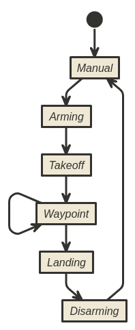
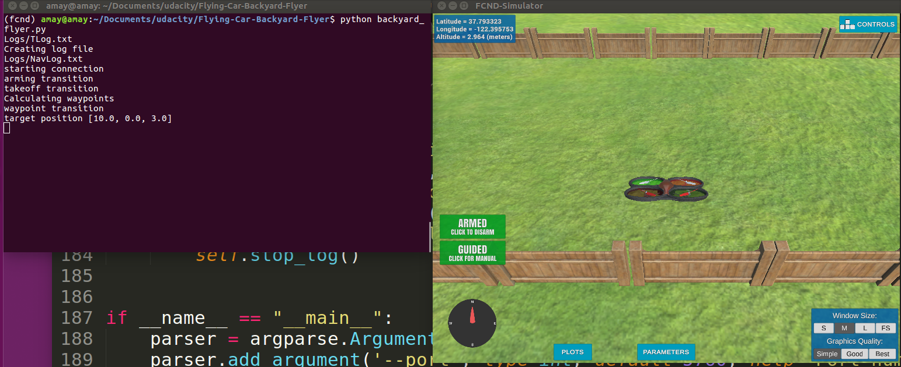
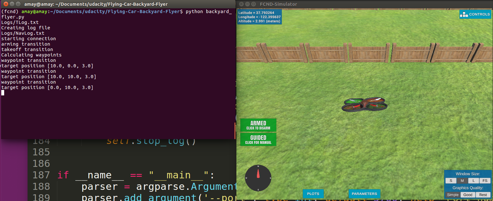
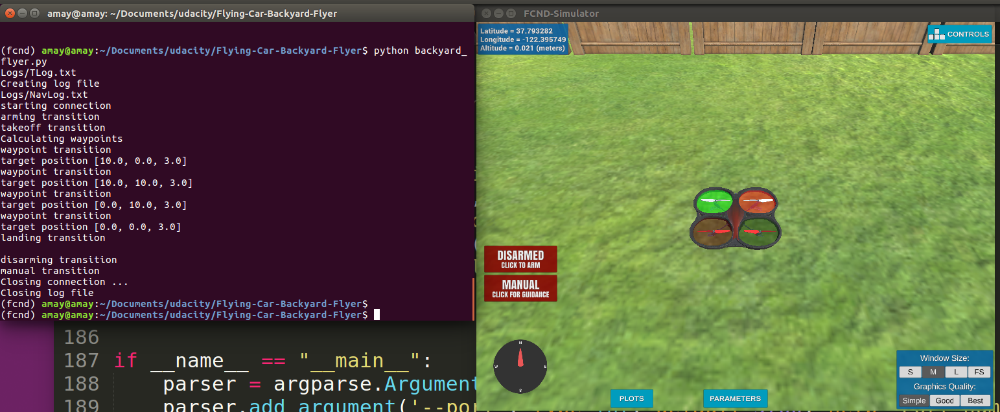

# WRITEUP

Problem Statement.
1. Get the Drone up in the air. exactly above it's origin point
2. Once up Make the drone fly in straight straight line without dwindling.
3. Make the drone fly in a square trajectory and land back at the point it originted from.

## Mission Script

### Fill in the state transition methods for Drone class: `arming_transition()`, `takeoff_transition()`, `waypoint_transition()`, `landing_transition()`, and `disarming_transition()` are all filled in.

I have filled in the all thed drone class functions that will help the drone to fly. Using the drone leaves little to be done in these functions. It was just a couple of API calls and then putting the drone flight_state into the state corresponding to that function.

The calculate box is also quite easy I have just put in 4 points that includes x,y,x coordinates which if connected create a sqare

|   x   |   y   |    z  |
|-------|-------|-------|
| 10.0  |  0.0  |  3.0  |
| 10.0  | 10.0  |  3.0  |
| 0.0   | 10.0  |  3.0  |
| 0.0   |  0.0  |  3.0  |

### Fill in the appropriate callbacks. Shell `state_callback`, `local_position_callback`, and `velocity_callback` are provided though they may not be required for all states.

The callbacks are based on the current position and velocity of the drone and flight state of the drone. Once the dron completes 1 checkpoint we can put it into it's next state and or trajectory.

Diagram from http://www.nomnoml.com
[<start>start]->[<abstract>Manual]
[<abstract>Manual]->[<abstract>Arming]
[<abstract>Arming]->[<abstract>Takeoff]
[<abstract>Takeoff]->[<abstract>Waypoint]
[Waypoint]->[Waypoint]
[<abstract>Waypoint]->[<abstract>Landing]
[<abstract>Landing]->[<abstract>Disarming]
[<abstract>Disarming]->[Manual]

## Mission Analysis

### Running the `backyard_flyer.py` script correctly commands the vehicle to fly in a square.

Totally works checkout the log file and screenshots.

